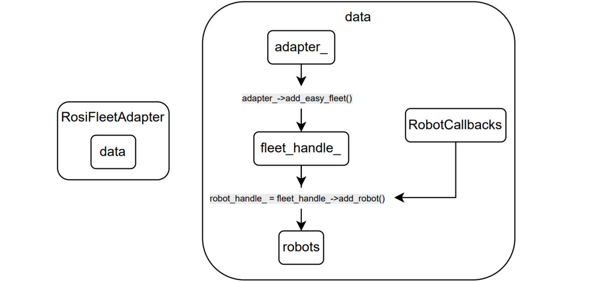

# fleet_adapter

This package provides a custom fleet adapter that allows **a robot** (the updated ROS 2 version) to be used with **OpenRMF**.

The fleet adapter serves as the direct interface between RMF and the robot. When using the `EasyFullControl` class, there is no need for a separate fleet manager or intermediate interface — the adapter communicates directly with the robot.

> ⚠️ **Note**: This code currently compiles, but several questions about the code structure and functioning remain to be clarified and tested.

## 1. Basic structure

As in the figure, `FleetAdapter` has only one a member attribute which is `data_`of type `Data`. This member encapsulates all handles needed to manage the fleet: an adapter handle (`adapter_`), a fleet handle (`fleet_handle_`) and the robot handles stored in an array (`robots`).

The architecture is centered around the `Adapter` class. An instance of this class is created, and the method `Adapter::add_easy_fleet()` is called to obtain a fleet handle used to register robots to the fleet.

Once a fleet is registered, robots are added through the custom method `FleetAdapter::addRobots()`. This method prepares all necessary objects to call `EasyFullControl::add_robot()`, which returns a `EasyRobotUpdateHandle` object. This handle is then stored internally in the `FleetAdapter` class under the `data_`.

To call `EasyFullControl::add_robot()`, each robot must have a `RobotCallbacks` object. This object provides callbacks that connect to the internal methods of the `Robot` class. These internal methods implement the navigation and task execution logic.

During task execution, the robot must continuously call `robot_handle_->update()` with a `RobotState` and `ActivityIdentifier`, so RMF can monitor the task's progress.



### 1.1. Task execution flow example

Suppose the robot receives a navigation task to a target position `(X, Y)`. The following steps occur:

1. The callback `RobotCallbacks::NavigationRequest()` is invoked.
2. It calls `Robot::navigate()`, passing the destination and an execution handle.
3. Inside `Robot::navigate()`, a navigation goal is sent to the robot's action server.
4. If the action is accepted, a dedicated thread is started to periodically update the robot's state.
5. When the navigation completes (successfully, aborted, or canceled), the thread stops and the robot waits for the next task.

### 1.2. The `Robot` class

This class is responsible for interfacing with the actual robot hardware/software and translating RMF task requests into actionable commands.

The `Robot` class encapsulates all robot-specific logic, including:
- Subscriptions to ROS topics;
- Client services;
- Action servers provided by the nav2 stack.

## 2. Installation

Install the OpenRMF binaries with
```bash
sudo apt install ros-jazzy-rmf-dev
```

Clone all this repositories to some workspace inside the robot (let it be ```some_ws``` as an example), then build it with the shell commands
```bash
cd ~/some_ws/src
git clone https://gitlab.com/gscar-coppe-ufrj/projeto-quadrupedes/fleet_adapter.git
cd ~/some_ws
colcon build --cmake-args -DCMAKE_EXPORT_COMPILE_COMMANDS=ON
source ~/some_ws/install/setup.bash
``` 

The export compile commands is optional. It generates a ```compile_commands.json``` in the build folder, which can be used by clangd, assisting the user while editing code with vscode.

Optionally, add the source command to your ```.bashrc``` with 
```bash
echo "source ~/some_ws/install/setup.bash" >> ~/.bashrc
```